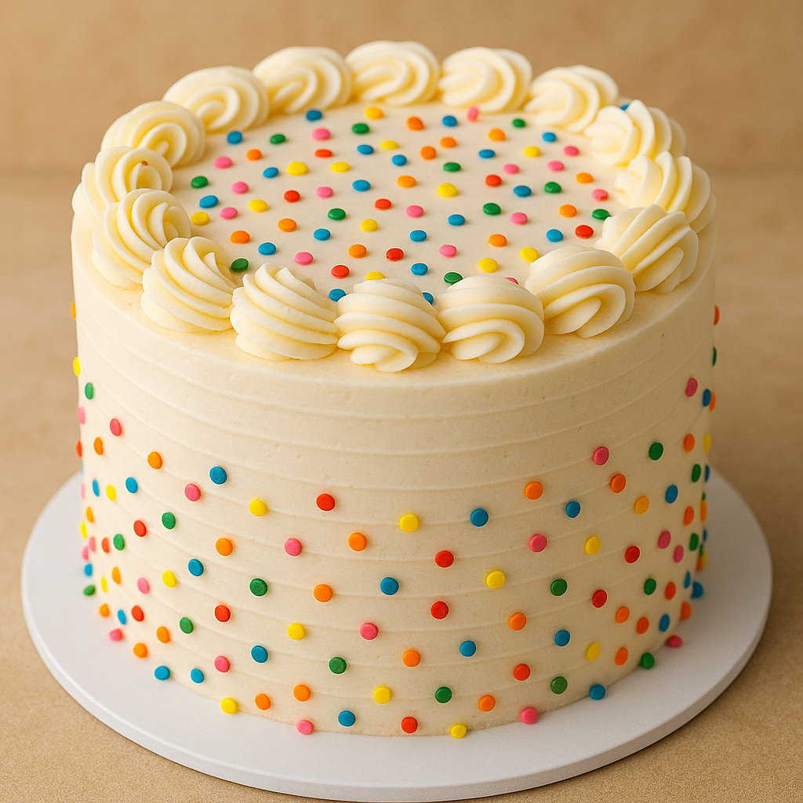
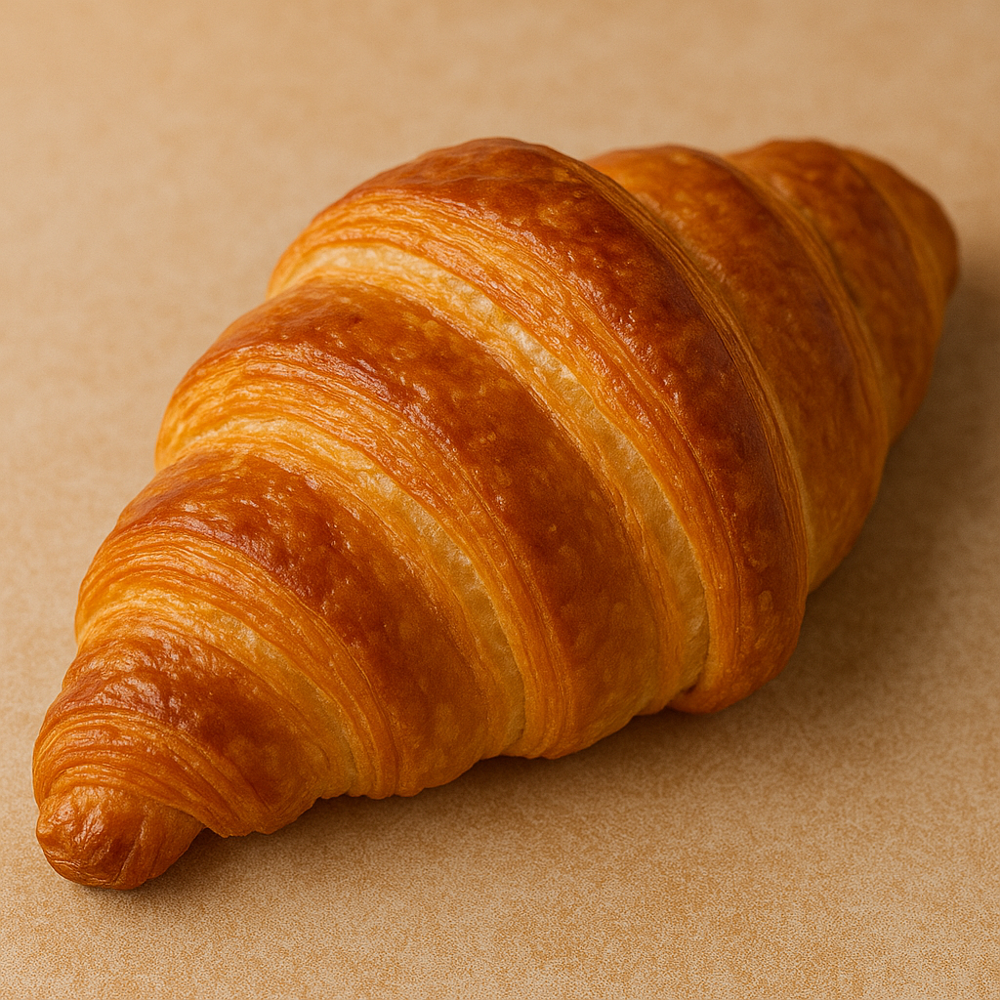
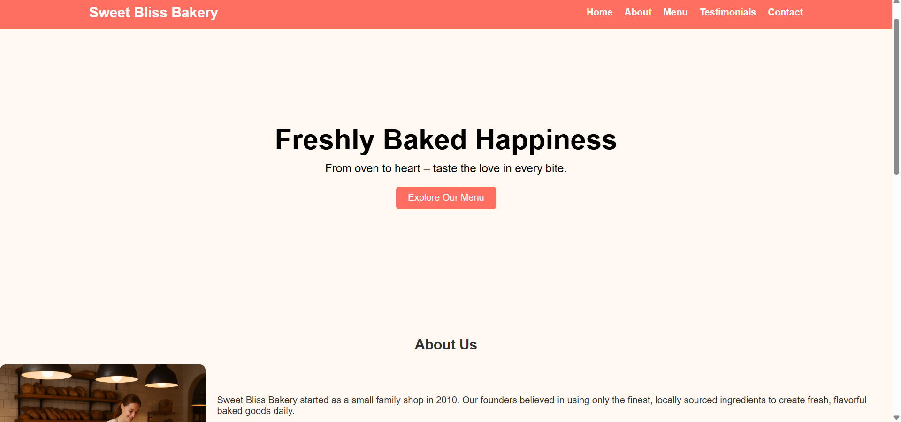
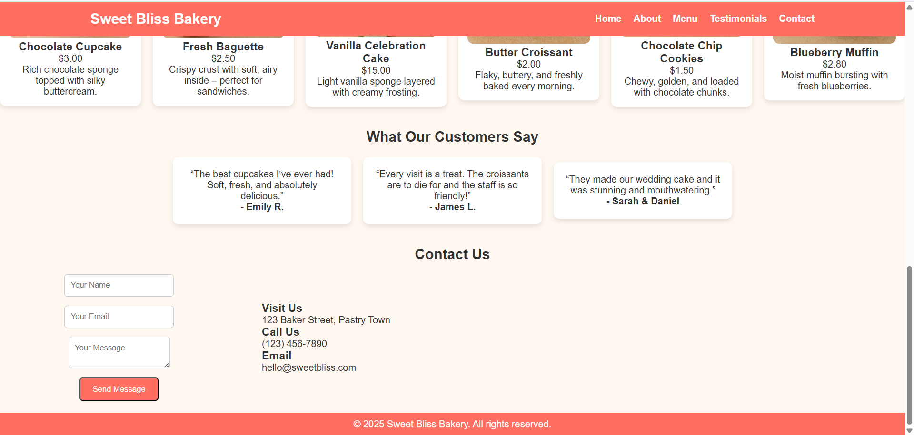

# Ex02 Commercial Website
## Date:

## AIM
To create a commercial website using CSS Flexbox.

## ALGORITHM
### STEP 1
Create an HTML file (index.html)

### STEP 2
Create a CSS file (style.css)

### STEP 3
Include a navigation bar with links to different sections.

### STEP 4
Add structured sections for Homepage, Products / Services, About Us, Contact Details and User Account.

### STEP 5
Include social media links at the footer with copyright information.

### STEP 6
Define global styles for fonts, colors, and layout.

### STEP 7
Style the header, navigation bar, and sections.

### STEP 8
Use Flexbox for layout design.

### STEP 9
Add hover effects and transitions for interactivity.

### STEP 10
Add Images and Media.

### STEP 11
Use optimized images for a professional look.

### STEP 12
Open the HTML file in a browser to check layout and functionality.

### STEP 13
Fix styling issues and refine content placement.

### STEP 14
Deploy the website.

### STEP 15
Upload to GitHub Pages for free hosting.

## PROGRAM

index.html

```
<!DOCTYPE html>
<html lang="en">
<head>
    <meta charset="UTF-8">
    <meta name="viewport" content="width=device-width, initial-scale=1.0">
    <title>Sweet Bliss Bakery</title>
    <link rel="stylesheet" href="style.css">
</head>
<body>
    <header>
        <div class="logo">Sweet Bliss Bakery</div>
        <nav>
            <a href="#home">Home</a>
            <a href="#about">About</a>
            <a href="#menu">Menu</a>
            <a href="#testimonials">Testimonials</a>
            <a href="#contact">Contact</a>
        </nav>
    </header>

    <section id="home" class="hero">
        <div class="hero-content">
            <h1>Freshly Baked Happiness</h1>
            <p>From oven to heart – taste the love in every bite.</p>
            <a href="#menu" class="btn">Explore Our Menu</a>
        </div>
    </section>

    <section id="about" class="about">
        <h2>About Us</h2>
        <div class="about-content">
            
            <div>
                <p>Sweet Bliss Bakery started as a small family shop in 2010. Our founders believed in using only the finest, locally sourced ingredients to create fresh, flavorful baked goods daily.</p>
                <br>
                <p>From artisanal breads and fluffy pastries to decadent cakes, we pour our hearts into everything we bake. Every morning, our ovens are filled with the aroma of fresh dough, butter, and chocolate.</p>
                <br>
                <p>We are proud to serve our community, and we believe that a warm loaf of bread or a sweet treat can brighten anyone's day.</p>
            </div>
        </div>
    </section>

    <section id="menu" class="menu">
        <h2>Our Menu</h2>
        <br>
        <p>Freshly baked, every single day.</p>
        <div class="menu-items">
            <div class="item">
                
                <h3>Chocolate Cupcake</h3>
                <p>$3.00</p>
                <p>Rich chocolate sponge topped with silky buttercream.</p>
            </div>
            <div class="item">
                
                <h3>Fresh Baguette</h3>
                <p>$2.50</p>
                <p>Crispy crust with soft, airy inside – perfect for sandwiches.</p>
            </div>
            <div class="item">
                
                <h3>Vanilla Celebration Cake</h3>
                <p>$15.00</p>
                <p>Light vanilla sponge layered with creamy frosting.</p>
            </div>
            <div class="item">
                
                <h3>Butter Croissant</h3>
                <p>$2.00</p>
                <p>Flaky, buttery, and freshly baked every morning.</p>
            </div>
            <div class="item">
                
                <h3>Chocolate Chip Cookies</h3>
                <p>$1.50</p>
                <p>Chewy, golden, and loaded with chocolate chunks.</p>
            </div>
            <div class="item">
                
                <h3>Blueberry Muffin</h3>
                <p>$2.80</p>
                <p>Moist muffin bursting with fresh blueberries.</p>
            </div>
        </div>
    </section>

    <section id="testimonials" class="testimonials">
        <br><br>
        <h2>What Our Customers Say</h2>
        <div class="testimonial-list">
            <div class="testimonial">
                <p>“The best cupcakes I’ve ever had! Soft, fresh, and absolutely delicious.”</p>
                <h4>- Emily R.</h4>
            </div>
            <div class="testimonial">
                <p>“Every visit is a treat. The croissants are to die for and the staff is so friendly!”</p>
                <h4>- James L.</h4>
            </div>
            <div class="testimonial">
                <p>“They made our wedding cake and it was stunning and mouthwatering.”</p>
                <h4>- Sarah & Daniel</h4>
            </div>
        </div>
    </section>

     <br><br>
    <section id="contact" class="contact">
        <h2>Contact Us</h2>
        <div class="contact-container">
            <form>
                <input type="text" placeholder="Your Name" required>
                <input type="email" placeholder="Your Email" required>
                <textarea placeholder="Your Message" required></textarea>
                <button type="submit" class="btn">Send Message</button>
            </form>
            <div class="contact-info">
                <h3>Visit Us</h3>
                <p>123 Baker Street, Pastry Town</p>
                <h3>Call Us</h3>
                <p>(123) 456-7890</p>
                <h3>Email</h3>
                <p>hello@sweetbliss.com</p>
            </div>
        </div>
    </section>

    <footer>
        <p>© 2025 Sweet Bliss Bakery. All rights reserved.</p>
    </footer>
</body>
</html>
```
<br>

style.css
```
* {
    margin: 0;
    padding: 0;
    box-sizing: border-box;
    font-family: 'Arial', sans-serif;
    align-items: center;
}

body {
    background: #fff8f0;
    color: #333;
}

header {
    background: #ff6f61;
    color: white;
    display: flex;
    justify-content: space-between;
    align-items: center;
    padding: 15px 10%;
    position: sticky;
    top: 0;
    z-index: 100;
}

header .logo {
    font-size: 1.5em;
    font-weight: bold;
}

nav {
    display: flex;
    gap: 20px;
}

nav a {
    color: white;
    text-decoration: none;
    font-weight: bold;
}

nav a:hover {
    text-decoration: underline;
}

.hero {
    background: url('https://images.unsplash.com/photo-1606312618905-5d1b2cf6a2f6') no-repeat center/cover;
    height: 80vh;
    display: flex;
    justify-content: center;
    align-items: center;
    color: white;
    text-align: center;
    padding: 0 20px;
}

.hero-content {
    max-width: 600px;
    color: #000;
}

.hero h1 {
    font-size: 3em;
    margin-bottom: 10px;
}

.hero p {
    font-size: 1.2em;
    margin-bottom: 20px;
}

.btn {
    background: #ff6f61;
    padding: 10px 20px;
    color: white;
    border-radius: 5px;
    text-decoration: none;
    display: inline-block;
}

.btn:hover {
    background: #e85c50;
}

.about-content {
    display: flex;
    gap: 20px;
    align-items: center;
    flex-wrap: wrap;
    margin-top: 20px;
}

.about-content img {
    width: 350px;
    border-radius: 10px;
    flex-shrink: 0;
}

.about-content div {
    flex: 1;
}

.menu-items {
    display: flex;
    gap: 20px;
    justify-content: center;
    flex-wrap: wrap;
    margin-top: 20px;
}

.item {
    background: white;
    padding: 15px;
    border-radius: 10px;
    box-shadow: 0px 4px 8px rgba(0,0,0,0.1);
    width: 220px;
    flex: 1 1 220px;
    text-align: center;
}

.item img {
    width: 100%;
    border-radius: 10px;
}

.item:hover {
    background: #000;
    padding: 15px;
    border-radius: 15px;
    box-shadow: 0px 4px 8px rgba(255, 255, 255, 0.9);
    color: white;
    width: 270px;
}

/* Testimonials */
.testimonial-list {
    display: flex;
    gap: 20px;
    justify-content: center;
    flex-wrap: wrap;
    margin-top: 20px;
}

.testimonial {
    background: white;
    padding: 20px;
    border-radius: 10px;
    box-shadow: 0px 4px 8px rgba(0,0,0,0.1);
    max-width: 300px;
    text-align: center;
}

.contact-container {
    display: flex;
    gap: 40px;
    justify-content: center;
    flex-wrap: wrap;
    margin-top: 20px;
}

form {
    display: flex;
    flex-direction: column;
    gap: 15px;
    max-width: 400px;
    flex: 1;
}

input, textarea {
    padding: 10px;
    border: 1px solid #ccc;
    border-radius: 5px;
}

.contact-info {
    flex: 1;
    min-width: 250px;
}

button {
    cursor: pointer;
}

footer {
    background: #ff6f61;
    color: white;
    text-align: center;
    padding: 10px;
    margin-top: 20px;
}

h2 {
    text-align: center;
}

@media (max-width: 768px) {
    header {
        flex-direction: column;
    }
    nav {
        margin-top: 10px;
    }
    .about-content {
        flex-direction: column;
        text-align: center;
    }
}
```

## OUTPUT





## RESULT
The program for creating commercial website using CSS Flexbox is executed successfully.
